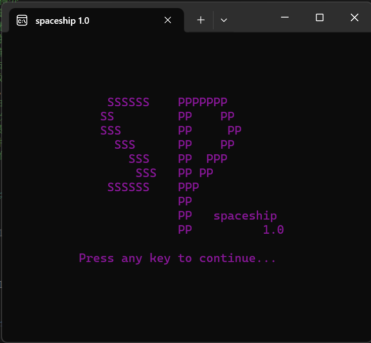
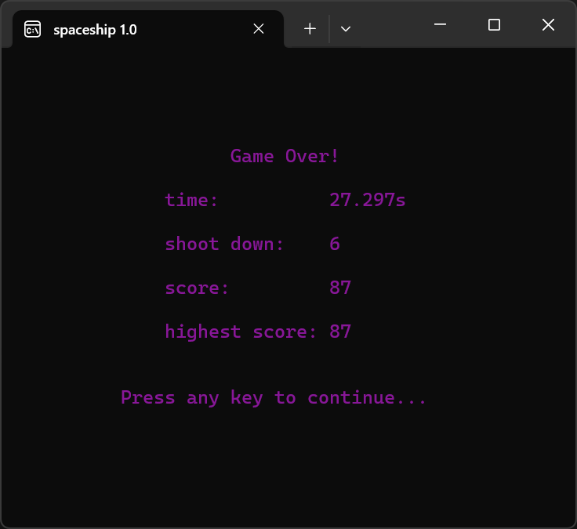

# a-windows-console-spaceship-game

使用C++编写，运行在Windows系统控制台中的飞船大战游戏。

## 一、游戏介绍

这款游戏完全由 **C++** 编写，简单、易懂、零基础。
文档中的`cppgame.h`相当于一个超迷你的游戏引擎；`main.cpp`通过调用其中的函数来配置或显示游戏中所谓的“图形”。通过创建、修改、读取文本文档来记录历史最高分。其中，使用Windows7的控制台效果最佳。

## 二、游戏内容

玩家通过键盘操纵飞船。使用`W、S、A、D`来控制飞船的四个方向上的移动；使用`K`来发射子弹，击毁敌机。当敌机撞到玩家时，玩家的护盾会减少，最终被击毁。玩家击毁的敌机数量越多，坚持的时间越长，最终的得分就越高。

其中，两个按键不能同时按下；也就是说，想要一边移动一边发射子弹，必须交替按下方向键和发射键。~~也算是个Bug吧（bushi）~~
期待读者的反馈和加强。
